# UNIX/Linux operating systems (Basic)

## Part 1. Installation of the OS

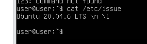
corrent version  

##  Part 2. Creating a user

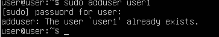

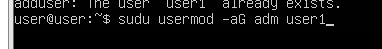

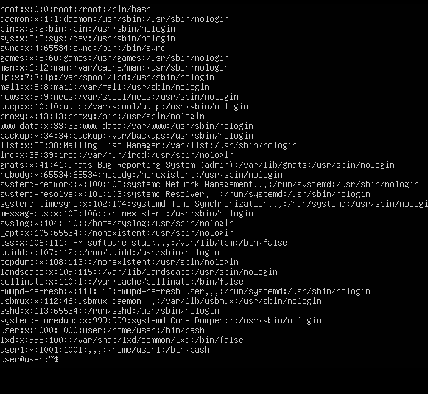

## Part 3. Setting up the OS network

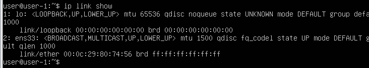

loopback (коротко говоря lo) — это аппаратный или программный метод, который направляет полученный сигнал или данные обратно отправителю. Он используется как дополнительное средство в исправлении проблем физического соединения.

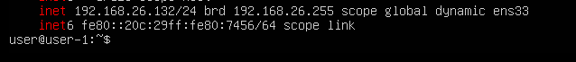

DHCP расшифровывается как "Dynamic Host Configuration Protocol" (Протокол динамической конфигурации хоста). Это сетевой протокол, который автоматически назначает IP-адреса, параметры сети и другую информацию устройствам (как правило, компьютерам) в сети. Протокол DHCP позволяет устройствам автоматически получать сетевые настройки без необходимости вручную настраивать каждое устройство.
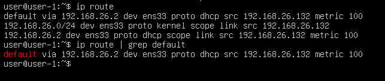

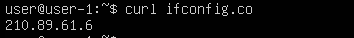

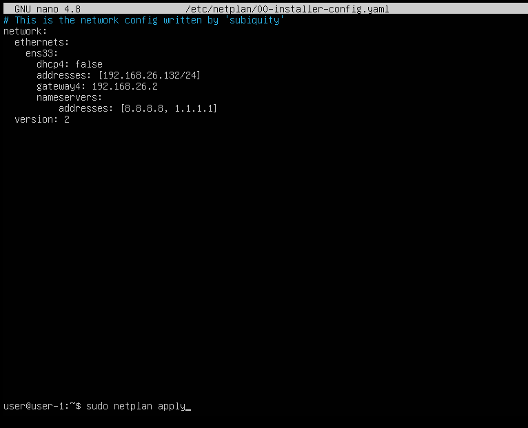

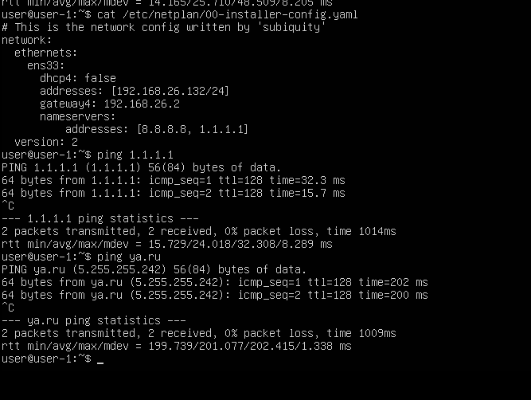

## Part 4. OS Update

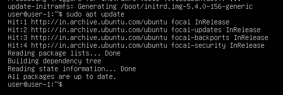

## Part 5. Using the sudo command

sudo (Superuser Do) - это команда в Unix-подобных операционных системах, таких как Ubuntu, предназначенная для выполнения команд с привилегиями суперпользователя (root) или другого пользователя с административными правами. Это позволяет пользователям выполнять задачи, которые требуют повышенных привилегий, без необходимости постоянного входа в систему как суперпользователь.

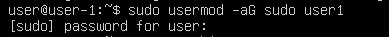

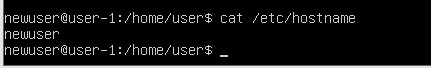

## Part 6. Installing and configuring the time service

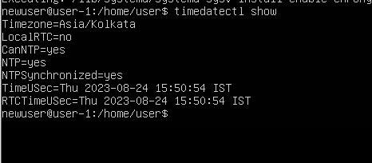

## Part 7. Installing and using text editors
Были установлены nano, vim и mcedit.
`sudo apt install vim`
`sudo apt install mc`
`sudo apt install nano`

- Создане файла test_vim.txt  `sudo vim test_vim.txt`, для выхода из редактора с сохранением `Esc`, `:`, `wq`.

- Создание текстового файла test_nano.txt `sudo nano test_nano.txt`, для выхода из редактора с сохранением `Ctrl+0`, `Ctrl+x`

- Создание текстого файла test_mcedit.txt `sudo mcedit test_mcedit.txt` для выхода из редактора с сохранением `F-2`, `F-10`

 - Открытие файла test_vim.txt `sudo vim test_vim.txt`, `R` для редактирования `i`, для выхода из файла без сохраненией `Esc`, `:`, `q!`
 
 - Вывод содержимого `cat test_vim.txt`
 
 - Открытие файла test_nano.txt `sudo nano test_nano.txt`, для редактирования, выходим без сохранения `Ctrl+X`, `n`
 
 - Вывод содержимого `cat test_nano.txt`
  
 -  Открытие файла test_mcedit.txt, `sudo mcedit test_mcedit.txt`, для редакттрования, выходим без сохранения `F-10`
 
 - Вывдо содержимого файла `cat test_mcedit.txt`
 

 - Открытие файла `sudo vim test_vim_txt`, поиск слова и замена искоемого `:/School`
 
 - Команда для замены искоемого слова `:s/School/Shamil`
 
 - Открытие файла `sudo nano test_nano.txt`, поиск слова `Ctrl + W`
 
 - Комада для замены искоемого слова `CTRL + R`, `new word`, `Y`
 
 - Открытие файла `sudo mcedit test_mcedit.txt`, поиск слова `F-7`
 
 - Команда для замены исвкоемого слова `F-4`, `replace`
 

## Part 8. Installing and basic setup of the SSHD service

 - Установить пакет openssh `sudo apt install openssh-server`
 - Добавьте пакет SSH-сервера в автозагрузку `sudo systemctl enable sshd`
 - Проверьте работу SSH `systemctl status sshd `
 - Изиенение порта на 2022 `sudo vim /etc/ssh/sshd_config`
  
 - С помощью команды ps показать наличие sshd 
  

Команда ps используется для просмотра информации о текущих процессах, работающих в операционной системе. Она может принимать различные параметры и флаги для отображения более подробной информации о процессах. Вот некоторые ключи (флаги), которые можно использовать с командой ps:

-e или --everyone: Показать все процессы, включая процессы всех пользователей.

-f или --full: Вывести полный формат вывода, который включает дополнительные детали о процессах.

-l или --long: Вывести вывод в формате длинного списка, содержащего более подробные сведения.

-u <username> или --user <username>: Отобразить процессы только для указанного пользователя.

-p <pid>: Отобразить информацию только о процессе с указанным идентификатором PID.

-o <format>: Определить пользовательский формат вывода, где вы можете выбирать, какие поля выводить.

-a или --all: Показать все процессы, кроме процессов, которые не имеют управляющего терминала.

-x или --deselect: Показать только процессы, не связанные с текущим терминалом.

-C <command>: Отобразить процессы, связанные с указанной командой.

-N или --sort=<key>: Сортировать список процессов по указанному ключу (например, %cpu для сортировки по использованию CPU).

-H: Вывести древовидную структуру процессов, показывая их связи родитель-потомок.

Это только некоторые из ключей, поддерживаемых командой ps. Вы можете получить более подробную информацию о доступных ключах и их использовании, введя команду man ps в терминале.

-n служит для печати IP-адресов вместо имен хостов; -a показывает состояние всех сокетов; -t показывает только tcp соединения; Значения столбцов: Proto - протокол, используемый сокетом; Recv-Q - количество байтов, не скопированных пользовательской программой, подключенной к этому сокету; Local Address - локальный адрес (имя локального хоста) и номер порта сокета Foreign Address - удаленный адрес (имя удаленного хоста) и номер порта сокета State - состояние сокета 0.0.0.0 в этом контексте означает "все IP-адреса на локальной машине"

## Part 9. Installing and using the top, htop utilities

uptime 4 min
авторизовано 1 user
total system load 0,25 0,6 0,3
total number of processes 240
cpu load 0.0
memory load 1940.5
pid процессора занимающего больше всего памяти 1449
pid процесса занимающего больше всего процессорного времени 1610

- P: Сортировка по процентному использованию CPU.

- M: Сортировка по использованию оперативной памяти (RAM).

- N: Сортировка по PID (идентификатору процесса).

- T: Сортировка по времени выполнения.

- отфильтрованному для процесса sshd

- с процессом syslog, найденным, используя поиск

- с добавленным выводом hostname, clock и uptime

## Part 10. Using the fdisk utility\

- name of the hard disk: VMware Virtual S
- capacity: 20 GiB
- number of sectors: 41943040
- swap size: 0

## Part 11. Using the df utility

- size 10218772
- used 4752724
- available 4925376
- Use 50%
- 1k-blocks

- partition size 9.8G
- space used 4.7G
- space free 4.7G
- percentage used 50% 
- Type ext4

## Part 12. Using the du utility

## Part 13. Installing and using the ncdu utility
Используем `sudo apt install ncdu` для скачивания

## Part 14. Working with system logs

- successful login time: aug 30, 16:17:01
- user name: newuser
- login method: secure shell server

## Part 15. Using the CRON job scheduler
Добавление команды:

Скрин из системного журнала:

Просмотр после удаления расписания:

